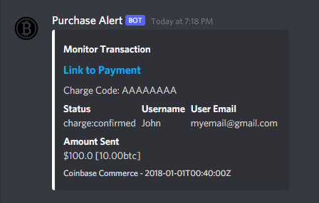
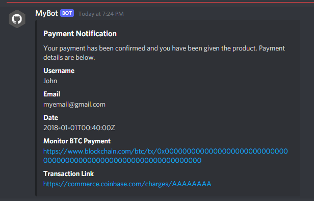
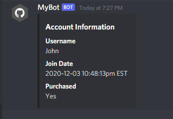

<h1 align="center">Coinbase Commerce Discord Bot</h1>

  
  
  
  
  
  
  
  

  <a href=#about>About</a> |
  <a href=#disclaimer>Disclaimer</a> |
  <a href=#overview>Overview</a> |
  <a href=#installing>Installing</a>

## About

This project demonstrates how to utilize the Discord and Coinbase Commerce API to create a bot that will allow customers to buy something with Bitcoin or other cryptocurrencies via Coinbase through Discord. The bot also does account management and purchase logging so you would be able to link a Discord account with an account created with your business and track the account's purchase history. 

## Disclaimer

There is no release version of this project as the code is not runnable after download because I haven't included the many library files in the name of simplicity. This is more of a **proof of concept** project that should be implemented into an existing project. This is also not actively maintained.
## Overview

### Commands

- !help - _Lists all available commands_
- !register [username] [password] [confirm password] - _Register a new account linked to the current Discord account_
- !account - _Gives you information about your account_
- !changepassword [username] [current password] [new password] [confirm new password] - _change your password_
- !relinkDiscord [username] [password] - _change the Discord account linked to users account_
- !purchase - _Details how to purchase_

### Purchasing and Purchase Logs

Purchasing works by utilizing Coinbase Commerce checkouts. When you create a checkout, there will be a permanent link that will direct customers to the checkout. Once visited, customers enter their name, email, and from there are given the information needed to make a payment. As their purchase progresses from Pending to Confirmed, the customer will receive update messages through Discord and purchase event logs will be posted in a designated server channel for the owner. Purchase tracking works by using the Coinbase Commerce webhook (configured in your settings page) to send a payload with all the info about an event to the [SendWebhook.php](https://github.com/dylancatapano/Coinbase-Commerce-Discord-Bot/blob/Backend/src/SendWebhook.php) file, which takes that info and uses a Discord webhook (created in your server settings) to send a message to the designated channel.

<h1 align="center">
  
  
</h1>

### Account Management

The bot has basic account management already. Customers can create an account that will be linked to their Discord using the `!register` command. From there they can view some simple account info with `!account`, change their password with `!changepassword`, or change the Discord account linked to the user account with `!relinkDiscord`. 
<h1 align="center">
  
</h1>

## Installing

In order to use this code, you will need to have your own Discord bot/application. I recommend following this easy and up to date guide [here](https://www.writebots.com/how-to-make-a-discord-bot/#The_Easiest_Method_Make_a_Discord_Bot_in_15-Minutes_or_Less) and follow the JavaScript version if you want to use this code. That guide will teach you how to create your bot, setup the code, and run your bot. From there you will have to configure a lot of this bot's code to work for your own purpose. The [config.json](https://github.com/dylancatapano/Coinbase-Commerce-Discord-Bot/blob/Discord_Bot/src/config.json) file is where the most important changes will be made. But other things like the messages the bot sends should be changed, as those are just generalized messages.
The backend files are just php files that need to be hosted somewhere like your website. The code is designed to work with MySQL databases. It uses Coinbase Commerce's php library found [here](https://github.com/coinbase/coinbase-commerce-php) (tip: you will need [composer](https://github.com/composer/composer) to install that). Again, you will have to go through the code and change various variables like database table names, database login information (set in [include.php](https://github.com/dylancatapano/Coinbase-Commerce-Discord-Bot/blob/Backend/src/include.php)), and the Discord Webhook link in [SendWebhook.php](https://github.com/dylancatapano/Coinbase-Commerce-Discord-Bot/blob/Backend/src/SendWebhook.php).
